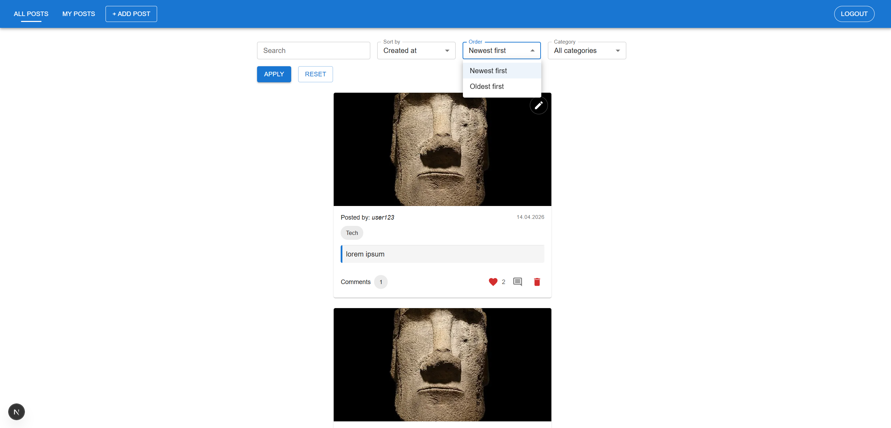
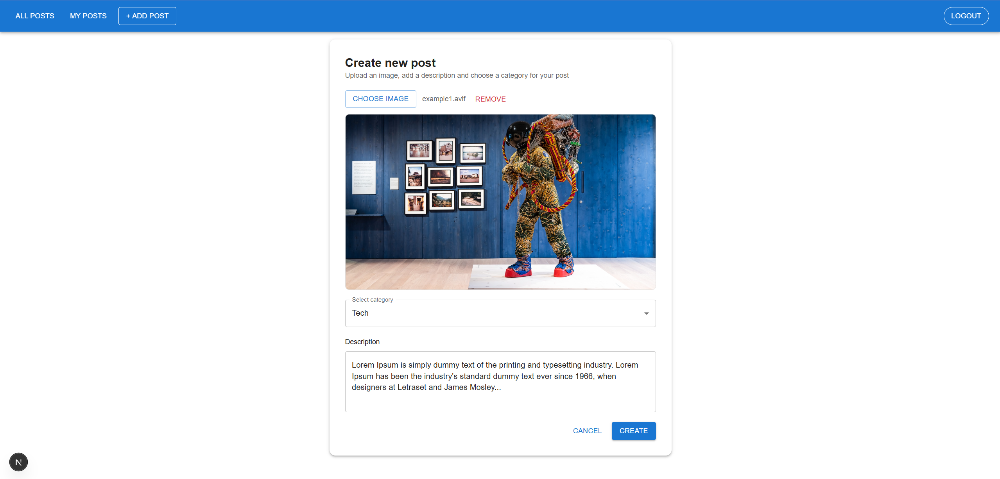
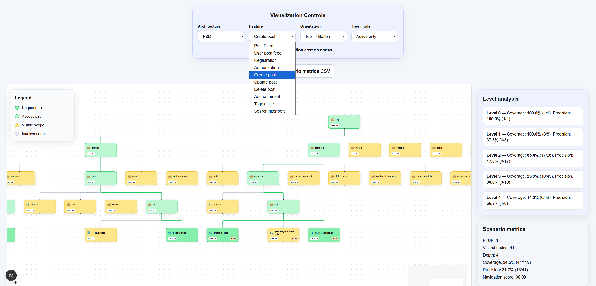
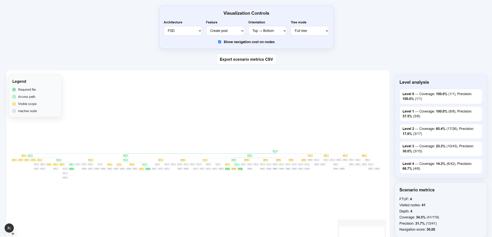

# Next.js Architecture Thesis

A practical project created as part of my Master's thesis in Software Engineering.

The goal of this project was to compare different ways of organizing frontend architecture in Next.js applications and analyze how project structure affects maintainability, scalability and navigation complexity.

The project is based on a museum blog platform, implemented using several architecture approaches.

## Overview

The application represents a museum content platform where exhibits are displayed as posts.

Main features include:

- browsing museum exhibits as posts
- post categorization
- search and filtering
- likes
- real-time notifications
- backend API integration
- admin-oriented content management logic

The same application domain was used to compare how different frontend architectures affect code organization and project maintainability.

## Architecture Approaches

This repository contains several frontend implementations:

- Monolithic architecture – a simple centralized structure, easier to start with but harder to maintain as the project grows.
- Modular / feature-based architecture – a structure organized around features and modules, focused on better separation of concerns.
- Feature-Sliced Design – a more formal architecture approach with clear responsibility separation between layers.

The comparison helped evaluate which structure provides the best balance between simplicity, scalability and maintainability for a Next.js application.
## Navigation Complexity Visualizer

The repository also includes a custom visualizer for analyzing frontend project structure.

The tool visualizes the folder structure of a project and helps compare architecture approaches by showing how difficult the project may be to navigate and maintain.

## Screenshots

### Museum Blog Platform
<table>
  <tr>
    <td>
      
    </td>
    <td>
      
    </td>
  </tr>
  <tr>
    <td align="center">Post feed with search, sorting and filtering</td>
    <td align="center">Create post page with image upload and category selection</td>
  </tr>
</table>


### Navigation Complexity Visualizer
<table>
  <tr>
    <td>
      
    </td>
    <td>
      
    </td>
  </tr>
</table>
The visualizer shows the structure of a selected architecture variant, feature navigation path, level analysis and scenario metrics.


## Repository Structure

```text
backend/
frontend-monolith/
frontend-modular/
frontend-fsd/
navigation-complexity-visualizer/
docs/
  screenshots/
  publications/
```

- `backend` – backend API used by the frontend applications
- `frontend-monolith` – frontend implementation using a monolithic project structure
- `frontend-modular` – frontend implementation using a modular / feature-based structure
- `frontend-fsd` – frontend implementation based on Feature-Sliced Design principles
- `navigation-complexity-visualizer` – tool for visualizing and analyzing project structure
- `docs/screenshots` – screenshots used in this README
- `docs/publications` – related thesis/research materials

## Tech Stack

### Frontend

- Next.js
- React
- TypeScript
- Redux Toolkit
- Axios
- Material UI

### Backend

- NestJS
- TypeScript
- PostgreSQL
- TypeORM
- Socket.IO

### Visualizer

- Next.js
- React
- TypeScript
- React Flow
- Dagre

## What I Worked On

- designed and implemented several frontend architecture variants
- built a Next.js application using different project structures
- compared monolithic, modular and Feature-Sliced Design approaches
- implemented backend API integration
- worked with REST API communication
- created a project structure visualizer
- analyzed navigation complexity in frontend applications
- prepared the practical part of my Master's thesis

## Key Takeaways

The modular / feature-based architecture provided the best balance between simplicity and maintainability.

Feature-Sliced Design offered a more scalable and formal structure, but introduced additional complexity for a smaller project.

The monolithic structure was the easiest to start with, but became less convenient as the application grew.

The navigation complexity visualizer helped support the comparison by making project structure easier to inspect and analyze visually.

## Related Publication

This research was also supported by a publication based on the thesis topic.

- [Research article PDF](./docs/publications/nextjs-architecture-thesis-article.pdf)
